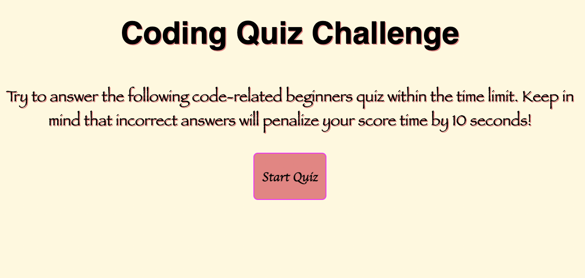

# codeQuiz

Create a timed JavaScript fundamentals quiz that stores high scores. 

## Purpose
* Create a timed coding quiz that: 
    * A start button is clicked, a timer starts and a question is presented.
    * When the question is answered, a next question is presented. 
    * When a question is answered wrongly, then time is subtracted.
    * When all questions are answered or time reaches 0, the quiz ends. 
    * When quiz ends, highscores are presented. 
    
## Built with 
* HTML
* JAVASCRIPT
* CSS

## Website
https://maa-hub.github.io/codeQuiz/

## Contribution
Made with ❤️ by Maame

